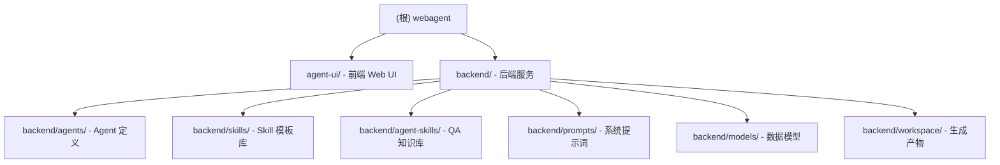

# Web Builder Coding Agent

## 项目愿景

基于 Agno 框架的「网页生成编程 Agent」系统（MVP 阶段）。产品形态为模板库（Skills）：用户选择模板 -> 补充少量需求 -> Agent 生成可运行的前端网页项目并返回结构化交付信息（JSON）。

当前状态：**MVP 已实现**，包含完整的多 Agent 协作后端、Web UI 前端、模板系统和 QA 审查流程。

## 架构总览

系统分为三层：

- **前端（Agent UI）**：基于 Next.js 15 的聊天式交互界面，支持流式响应、会话管理、多 Agent 切换
- **后端（Orchestrator）**：基于 Agno 框架的 Agent 编排层，提供 CLI 和 AgentOS 两种运行模式
- **执行层（Agents）**：Developer Agent（代码生成）+ QA Agent（质量审查）+ Workflow（协作编排）

技术栈：
- 后端：Python 3 + Agno 2.2.13 + FastAPI + SQLAlchemy + SQLite
- 前端：Next.js 15.5.10 + React 18 + TypeScript + Tailwind CSS + Zustand + Radix UI
- LLM：OpenAI 兼容接口（支持 GPT-5.3-Codex / GLM-5 / Kimi-K2.5）
- 模板格式：YAML

## 模块结构图



## 模块索引

| 模块 | 路径 | 语言 | 职责 | 状态 |
|------|------|------|------|------|
| Agent UI | `agent-ui/` | TypeScript | 聊天式交互界面、流式响应、会话管理 | ✅ 已实现 |
| 后端服务 | `backend/` | Python | AgentOS 服务 + CLI 入口 | ✅ 已实现 |
| Agent 定义 | `backend/agents/` | Python | Developer / QA / Workflow 三层 Agent | ✅ 已实现 |
| Skill 模板 | `backend/skills/` | YAML | 网页类型规格模板 | ✅ 已有 1 个模板 |
| QA 知识库 | `backend/agent-skills/` | Markdown | React 最佳实践、UI/UX 规范、性能审计 | ✅ 已有 3 个规则集 |
| 系统提示词 | `backend/prompts/` | Text | Developer 宪法 + QA 审查规则 | ✅ 已实现 |
| 数据模型 | `backend/models/` | Python | QAReport / QAIssue (Pydantic) | ✅ 已实现 |

## 核心概念

- **Skill（模板/能力包）**：面向用户的网页类型模板，YAML 格式存储于 `backend/skills/`。包含 `prompt_template`（页面规格）、`constraints`（约束）、`acceptance`（验收标准）。
- **Run（一次生成任务）**：唯一 `run_id`，独立工作目录 `backend/workspace/<run_id>/`，包含生成的完整前端项目。
- **输出契约**：Workflow 最终输出严格 JSON，包含 `run_id / status / workdir / skill / stack / qa` 等字段。
- **QAReport**：QA Agent 的结构化输出（Pydantic 模型），包含 `passed / score / summary / issues / fixed_files`。

## Agent 架构

### Developer Agent (`backend/agents/developer.py`)

- 加载 `prompts/system_prompt.txt` 作为系统提示词（宪法级）
- 加载 Skill YAML 模板作为差异化规格
- 使用 ShellTools + FileTools 在 workspace 中生成完整前端项目
- 执行自检：`npm install && npm run build`

### QA Agent (`backend/agents/qa.py`)

- 加载 `prompts/qa_prompt.txt` 作为审查规则
- 加载 `agent-skills/` 下的专业知识库（React 最佳实践、UI/UX 规范、性能审计）
- 四维度审查：代码质量、UI/UX 设计、性能、可访问性
- 输出结构化 QAReport（Pydantic `response_model`）
- 可直接修复 critical 级别问题

### Workflow (`backend/agents/workflow.py`)

多 Agent 协作编排，四阶段流水线：

1. **Phase 1 - Developer 生成**：根据 Skill 模板 + 用户需求生成完整项目
2. **Phase 2 - QA 审查**：QA Agent 审查生成的代码，输出 QAReport
3. **Phase 3 - 条件修复**：若 QA 未通过且有 critical 问题，反馈给 Developer 修复（最多 1 轮）
4. **Phase 4 - 交付**：输出结构化 JSON 交付结果

## 运行模式

### 一键开发模式（推荐）

项目根目录提供 `Makefile`，一条命令同时启动前后端，两边都带热重载：

```bash
# 首次运行需先安装依赖
make install

# 一键启动前后端开发环境（Ctrl+C 停止所有服务）
make dev
```

后端（端口 7777）改代码自动热重载，前端（端口 3000）改代码自动热更新，无需手动重启。

常用 Make 命令：

| 命令 | 说明 |
|------|------|
| `make dev` | 一键启动前后端（后端 :7777 + 前端 :3000，Ctrl+C 全部停止） |
| `make dev-backend` | 仅启动后端 |
| `make dev-frontend` | 仅启动前端 |
| `make install` | 一键安装前后端依赖 |
| `make cli` | CLI 交互模式（完整 Workflow） |
| `make run SKILL=restaurant-menu` | 直接运行指定模板 |
| `make stop` | 强制停止所有服务 |
| `make clean` | 清理临时文件和生成产物 |

### CLI 模式 (`backend/main.py`)

```bash
cd backend
cp .env.example .env  # 首次运行需配置 API Key

# 交互模式（选择模板 + 输入需求）
python main.py

# 命令行模式（直接指定 skill）
python main.py restaurant-menu "加一个搜索功能"
```

使用完整 Workflow（Developer + QA 协作），输出包含 QA 评分和修复信息。

### AgentOS 模式 (`backend/agentos.py`)

```bash
cd backend
python agentos.py  # 启动 HTTP 服务，端口 7777
```

- 注册 3 个不同模型的 Agent（GPT-5.3-Codex / GLM-5 / Kimi-K2.5），UI 中可切换
- 使用 SQLite 持久化会话（`backend/tmp/agents.db`）
- 支持流式响应
- 配合 Agent UI 前端使用

### 前端 (`agent-ui/`)

```bash
cd agent-ui
pnpm install
pnpm dev  # 启动开发服务器，端口 3000
```

在 UI 中配置后端地址（如 `http://<VPS公网IP>:7777`）即可使用。

## 目录约定

```
backend/
  workspace/<run_id>/     # 单次生成的项目根目录（完整 Vite + React 项目）
  skills/                 # Skill 模板文件（YAML）
  agent-skills/           # QA 专业知识库（Markdown）
  prompts/                # 系统提示词
  tmp/                    # SQLite 数据库等临时文件
```

## Prompt 策略

采用「单系统提示词 + 多 Skills」方案：
- System Prompt（宪法）：稳定不变，定义行为边界、工作流、自检、输出契约
- Skill Spec（模板法典）：差异化扩展，定义网页类型、功能、UI、验收点
- QA Prompt + Agent Skills：QA 审查规则 + 专业知识库

注入顺序：System Prompt -> Runtime Context -> Skill Spec -> User Input

## 已有模板

| Skill ID | 名称 | 描述 |
|----------|------|------|
| `restaurant-menu` | 餐厅菜单网页 | 精美的餐厅菜单展示页，支持分类浏览、菜品详情、响应式布局 |

## QA 知识库

| 知识库 | 路径 | 覆盖范围 |
|--------|------|---------|
| React 最佳实践 | `backend/agent-skills/react-best-practices/SKILL.md` | 组件设计、状态管理、Hooks 使用等 40+ 规则 |
| UI/UX 规范 | `backend/agent-skills/ui-ux-guidelines/SKILL.md` | 语义化、响应式、可访问性、设计一致性 |
| 性能审计 | `backend/agent-skills/performance-audit/SKILL.md` | Bundle 优化、加载性能、渲染性能 |

## 测试

```bash
# API 测试
cd backend
python test_api.py

# Shell 测试脚本
bash test_api.sh
bash test_api_stream.sh
bash test_models.sh
```

验收标准（所有 Skill 通用）：
- 必须在 `workspace/<run_id>/` 内生成完整项目
- 必须执行最小自检（`npm install && npm run build`）
- 必须返回严格 JSON（符合输出契约）
- 生成的网页能在本地运行或构建出静态产物

## 编码规范

生成代码约束：
- 禁止使用 emoji，所有 UI 图标必须使用 SVG
- 禁止使用需要密钥的在线服务、付费 API
- 禁止抓取/复制受版权保护的素材
- 优先少依赖、轻量实现
- 代码要求可读、模块化
- 默认加微交互（hover/transition/入场），不牺牲可用性
- 提供合理的空状态、加载状态、错误提示

安全约束：
- Agent 文件操作限定在 `workspace/<run_id>/` 内
- 自检失败最多修复重试 2 次（Workflow 中为 1 轮）
- 单 run 最大时长/磁盘占用需配置

## 环境配置

后端环境变量（`backend/.env`）：

| 变量 | 说明 | 默认值 |
|------|------|--------|
| `OPENAI_API_KEY` | LLM API 密钥 | 必填 |
| `OPENAI_BASE_URL` | LLM API 地址 | `https://kspmas.ksyun.com/v1` |
| `OPENAI_MODEL` | 默认模型 ID | `kimi-k2.5` |
| `AGENT_HOST` | 服务监听地址 | `0.0.0.0` |
| `AGENT_PORT` | 服务监听端口 | `7777` |

## 依赖

后端（`backend/requirements.txt`）：
- `agno==2.2.13` - Agent 框架
- `openai>=2.8.0` - LLM 客户端
- `fastapi[standard]>=0.115.0` - Web 框架
- `sqlalchemy>=2.0.0` - ORM（会话持久化）
- `pyyaml>=6.0` - YAML 解析
- `python-dotenv>=1.0.0` - 环境变量

前端（`agent-ui/package.json`）：
- `next@15.5.10` + `react@^18.3.1` - 框架
- `tailwindcss@^3.4.1` - 样式
- `zustand@^5.0.3` - 状态管理
- `@radix-ui/*` - UI 组件
- `framer-motion@^12.4.1` - 动画
- `react-markdown` + `rehype-*` + `remark-gfm` - Markdown 渲染

## AI 使用指引

- 核心项目文档：`编程 Agent 项目文档.md`（包含完整的系统提示词、Skill 规范、接口契约）
- Agent 系统提示词位于 `backend/prompts/system_prompt.txt`，为"宪法级"稳定规则
- Skills 不应重复系统提示词内容，只描述网页差异化规格
- 新增 Skill 模板放在 `backend/skills/` 下，YAML 格式，参考 `restaurant-menu.yaml`
- 新增 QA 知识库放在 `backend/agent-skills/<name>/SKILL.md`

## 关键文件

| 文件 | 说明 |
|------|------|
| `Makefile` | 开发命令集（`make dev` 一键启动前后端） |
| `编程 Agent 项目文档.md` | 项目完整规划文档（v0.1），包含架构、接口、Prompt 策略、Skill 规范 |
| `backend/agentos.py` | AgentOS 服务入口（Web UI 模式，端口 7777） |
| `backend/main.py` | CLI 模式入口（交互/命令行） |
| `backend/agents/developer.py` | Developer Agent 定义（代码生成） |
| `backend/agents/qa.py` | QA Agent 定义（质量审查） |
| `backend/agents/workflow.py` | 多 Agent 协作 Workflow（四阶段流水线） |
| `backend/models/schemas.py` | QAReport / QAIssue 数据模型 |
| `backend/prompts/system_prompt.txt` | Developer Agent 系统提示词（宪法） |
| `backend/prompts/qa_prompt.txt` | QA Agent 审查规则 |
| `backend/skills/restaurant-menu.yaml` | 餐厅菜单 Skill 模板 |
| `backend/.env.example` | 环境变量模板 |
| `backend/requirements.txt` | Python 依赖 |
| `agent-ui/package.json` | 前端依赖和脚本 |

## 变更记录 (Changelog)

| 日期 | 变更内容 |
|------|---------|
| 2026-02-15 | 新增 Makefile 一键启动前后端开发环境；文档同步更新运行模式、关键文件 |
| 2026-02-15 | 文档更新：同步 CLAUDE.md 至实际代码状态，补充 Agent 架构、运行模式、环境配置、依赖说明 |
| 2026-02-14 | MVP 实现：Developer + QA + Workflow 多 Agent 协作、AgentOS 服务、Agent UI 前端 |
| 2026-02-13 | 初始生成：基于项目规划文档创建根级 CLAUDE.md，记录架构规划、核心概念、接口契约、编码规范 |
